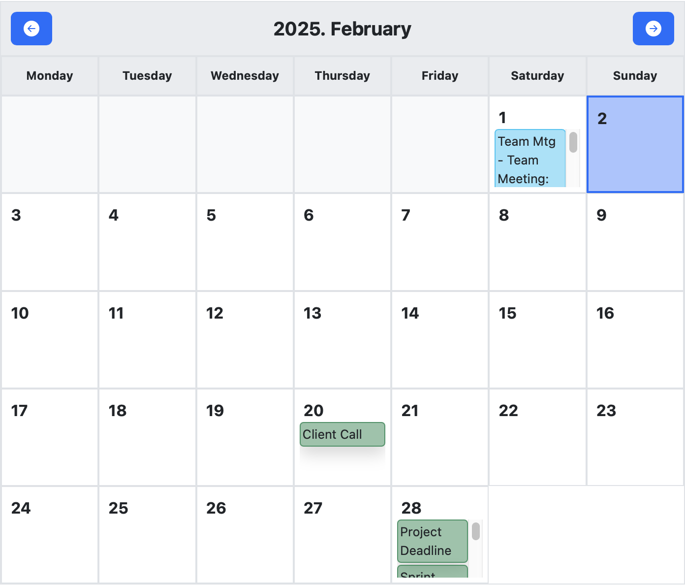
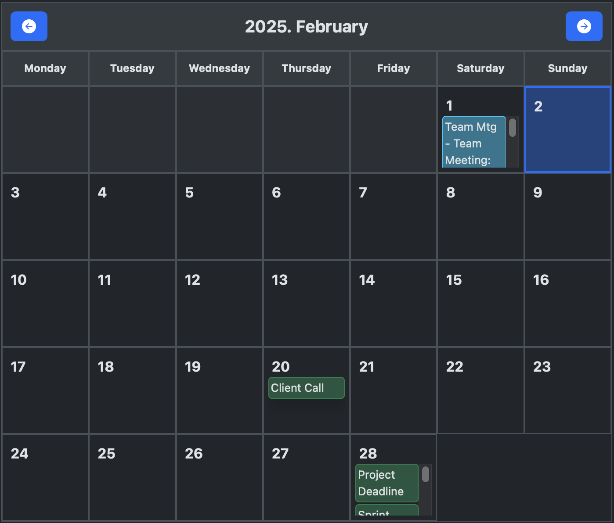

# Calendar JS Component






This project is a simple, responsive calendar component built with HTML, JavaScript, and CSS. The component:
- Renders a calendar with navigation buttons.
- Displays tasks assigned to individual days.
- Opens a detailed list of tasks in a Bootstrap modal when a day with tasks is clicked.
- Highlights the current day.
- Adapts responsively, including switching between long and short day names and task displays.

## Table of Contents

- [Installation](#installation)
- [Usage](#usage)
  - [Using the Bundle in HTML (Global Variable)](#using-the-bundle-in-html-global-variable)
  - [Using the Component in a Modular Environment](#using-the-component-in-a-modular-environment)
- [Development](#development)
- [Building](#building)
- [License](#license)

## Installation

1. **Clone the Repository**

    Clone the repository to your local machine:
    ```bash
    git clone https://github.com/csekme/calendar-js.git
    cd calendar-js
    ```

2. **Install Dependencies**

    Install the required packages:

    ```bash
    npm install
    ```

## Usage

The built component is located in the dist/ folder and includes the files ```calendar.js``` (the bundled JavaScript) and, if applicable, ```calendar.css``` (the bundled CSS). The component is configured to export as a UMD library so that it can be used as a global variable (e.g., ```window.Calendar```) or imported in a module system.

### Using the Bundle in HTML (Global Variable)

Create an HTML file (for example, ```index.html```) and include the bundled files:

```html
<!DOCTYPE html>
<html lang="en">
<head>
  <meta charset="UTF-8">
  <meta name="viewport" content="width=device-width, initial-scale=1">
  <title>Calendar Component Demo</title>
  <!-- Link the bundled CSS (if available) -->
  <link rel="stylesheet" href="dist/calendar.css">
  <!-- Bootstrap CSS for the modal functionality -->
  <link href="https://cdn.jsdelivr.net/npm/bootstrap@5.3.3/dist/css/bootstrap.min.css" rel="stylesheet">
</head>
<body data-bs-theme="dark">

    <!-- Bootstrap Modal for listing tasks -->
    <div class="modal fade" id="taskModal" tabindex="-1" aria-labelledby="taskModalLabel" aria-hidden="true">
    <div class="modal-dialog">
        <div class="modal-content">
        <div class="modal-header">
            <h5 class="modal-title" id="taskModalLabel">Tasks</h5>
            <button type="button" class="btn-close" data-bs-dismiss="modal" aria-label="Close"></button>
        </div>
        <div class="modal-body" id="taskModalBody">
            <!-- Itt jelennek meg dinamikusan a feladatok -->
        </div>
        <div class="modal-footer">
            <button type="button" class="btn btn-secondary" data-bs-dismiss="modal">Close</button>
        </div>
        </div>
    </div>
    </div>

  <!-- Container where the calendar will be rendered -->
  <div id="calendar-container" class="mt-4"></div>

  <!-- Include the bundled calendar component -->
  <script src="dist/calendar.js"></script>

  <script>
    // Example tasks
    const tasks = [
      { year: 2025, month: 2, day: 1, task: "Team Mtg", description: "Team Meeting: Weekly Sync and Project Updates", color: "#0BC6F4" },
      { year: 2025, month: 2, day: 20, task: "Client Call" },
      { year: 2025, month: 2, day: 28, task: "Project Deadline" },
      { year: 2025, month: 2, day: 28, task: "Sprint Review", description: "Sprint Review and Retrospective" }
    ];

    const calendarContainer = document.getElementById('calendar-container');
    // Using the Calendar constructor exported by the bundle (e.g., window.Calendar)
    const calendar = new Calendar(calendarContainer, 2025, 2, tasks);
  </script>
  <!-- Bootstrap JS for modal functionality -->
  <script src="https://cdn.jsdelivr.net/npm/bootstrap@5.3.3/dist/js/bootstrap.bundle.min.js"></script>
</body>
</html>

```

Constructor
```js
new Calendar(container, year, month, tasks, options);
```
Parameters
- ```container``` (Element): The DOM element where the calendar will be inserted.
- ```year``` (number): The year (e.g., 2025).
- ```month``` (number): The month (1 to 12).
- ```tasks``` (Array): JSON array containing task objects: ```{ year, month, day, task, description, color, attributes }```.
- ```options``` (Object): Optional settings for the calendar.

Options
- ```taskCallback``` (function): A callback function that is called when a calendar cell is clicked. The function receives the year, month, day, and tasks for the clicked day as parameters.
- ```dayNames``` (Array): An array of objects representing the names of the days of the week. Each object should have ```full``` and ```short``` properties.
- ```monthNames``` (Array): An array of objects representing the names of the months. Each object should have ```full``` and ```short``` properties.
- ```showButtons``` (boolean) show or hide navigation buttons of the calendar 
Example Options
```js
{
  taskCallback: function (year, month, day, tasks) {
    console.log(`Tasks for ${year}-${month}-${day}:`);
    console.table(tasks);
  },
  dayNames: [
    { full: 'Hétfő', short: 'H' },
    { full: 'Kedd', short: 'K' },
    { full: 'Szerda', short: 'Sz' },
    { full: 'Csütörtök', short: 'Cs' },
    { full: 'Péntek', short: 'P' },
    { full: 'Szombat', short: 'Sz' },
    { full: 'Vasárnap', short: 'V' }
  ],
  monthNames: [
    { full: 'Január', short: 'Jan' },
    { full: 'Február', short: 'Feb' },
    { full: 'Március', short: 'Már' },
    { full: 'Április', short: 'Ápr' },
    { full: 'Május', short: 'Máj' },
    { full: 'Június', short: 'Jún' },
    { full: 'Július', short: 'Júl' },
    { full: 'Augusztus', short: 'Aug' },
    { full: 'Szeptember', short: 'Sep' },
    { full: 'Október', short: 'Oct' },
    { full: 'November', short: 'Nov' },
    { full: 'December', short: 'Dec' }
  ]
}
```

Methods

```render()```

Renders the calendar in the specified container.

```changeMonth(offset)```

Changes the displayed month by the specified offset (e.g., ```-1``` for the previous month, ```1``` for the next month).

```setYear(year)```

Sets the year and re-renders the calendar.

```setMonth(month)```

Sets the month and re-renders the calendar. Throws an error if the month is not between 1 and 12.

Task Object

Each task object in the tasks array should have the following properties:

- ```year``` (number): The year of the task.
- ```month``` (number): The month of the task (1 to 12).
- ```day``` (number): The day of the task.
- ```task``` (string): The name of the task.
- ```description``` (string, optional): A description of the task.
- ```color``` (string, optional): A color code for the task.
- ```attributes``` (Array, optional): An array of objects representing additional attributes for the task element. Each object should have ```name``` and ```value``` properties.
Example Task

```json
{
  year: 2025,
  month: 2,
  day: 1,
  task: "Team Mtg",
  description: "Team Meeting: Weekly Sync and Project Updates",
  color: "#0BC6F4",
  attributes: [
    { name: 'id', value: 'task-1' },
    { name: 'data-uuid', value: '12345' }
  ]
}
```


### Using the Component in a Modular Environment
If you are working in an environment that supports ES6 modules (such as a React or Vue application), you can import the component as follows:
```js
// In an ES6 module (e.g., App.js)
import Calendar from './dist/calendar.js';

const container = document.getElementById('calendar-container');
const tasks = [
  { year: 2025, month: 2, day: 14, task: "UFI2", description: "Ultra Fine Indicator 2 Room" },
  // ...other tasks...
];

const calendar = new Calendar(container, 2025, 2, tasks);

```

## Development

- Source Code: The source code is located in the src/ folder:
    - ```src/calendar.js``` – The main JavaScript file for the component.
    - ```src/calendar.css``` – The component's styles.
- During development, it’s recommended to import the CSS directly in your JavaScript file:
    ```js
    import './calendar.css';
    ```
This ensures that webpack processes the CSS along with your component.
- Tests (if any) should be placed in the test/ folder.

## Building

To build the project, run the following command from the project root:

```bash
npm run build
```

This command uses webpack (with the configuration in webpack.config.js) to bundle your source files and output them to the dist/ folder (e.g., dist/calendar.js and dist/calendar.css).

## Licence

This project is licensed under the MIT License. See the LICENSE file for details.